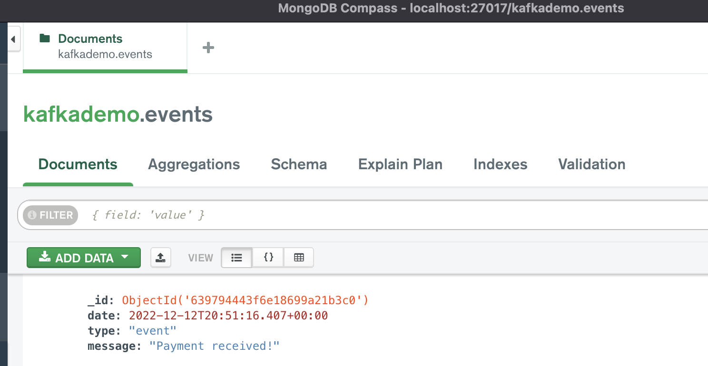

# MongoDB - Kafka connect
Setup guide for running Kafka and MongoDB within docker containers, and writing events to kafka which get persisted to MongoDB. Uses vanilla Kafka and Zookeeper (bitnami docker images), and Confluent's Kafka Connect

## Docker Images
We run the following images:
 - mongodb (single node, no database authentication)
 - apache zookeeper (needed by kafka)
 - apache kafka
 - kafka connect

## Steps
1. Start the docker images. It may take some time to download them if you do not already have them downloaded
```docker compose up```
2. Once everything is started, add the mongo-sink-connector. Edit the `addMongoSink.sh` file to change the parameters, such as the Kafka topic name, the MongoDB URL, other MongoDB options (database, collection)
```sh addMongoSink.sh```
3. If you are writing data to the kafka topic and events are already available, it will start to populate MongoDB. 
4. To manually add events, you can run 
```kafka-producer.py```

## View results in MongoDB
You can downloaded MongoDB Compass, a GUI for interacting with MongoDB. If you do, you can see the results of what you have written to the database.

